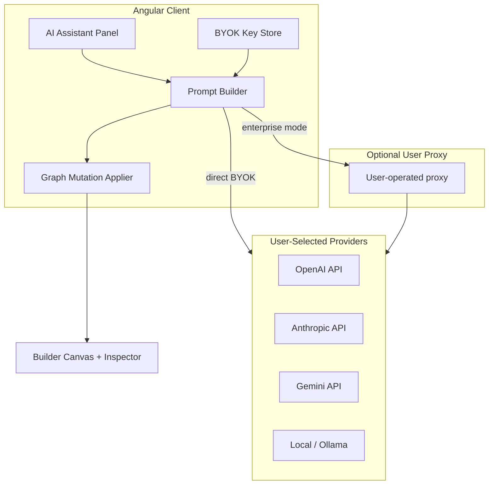

# AI & BYOK Integration

How RosettaDash will bring AI-assisted component creation to users while keeping **Bring Your Own Key (BYOK)** as the default security model. Users supply their own provider API keys; RosettaDash orchestrates prompts and applies results to the canvas — it does not resell or proxy AI at RosettaDash's expense.

**Phases:** [Phase 19 — BYOK](./10-roadmap.md#phase-19--byok-key-management-planned) · [Phase 20 — AI-assisted creation](./10-roadmap.md#phase-20--ai-assisted-component-creation-planned)

**Prerequisite work:** [Phase 18 — Builder creation assistance](./21-builder-creation-assistance.md) (DAS-69, complete) establishes animated, text-based guidance before AI is layered on.

---

## Goals

| Goal | Detail |
|------|--------|
| **Help users build faster** | Suggest components, bindings, layouts, and property values from natural language |
| **Respect user choice of provider** | OpenAI, Anthropic, Google, Azure OpenAI, local Ollama, etc. via BYOK |
| **Never leak keys** | Keys stay in the user's browser session (or their own backend proxy if they choose) |
| **Keep exports clean** | Generated composites export as normal RosettaDash output — no runtime dependency on RosettaDash AI |
| **Composable with existing UX** | Works alongside palette, grouping guides (DAS-43), defaults engine (DAS-32), and stack profile |

---

## Why BYOK first

RosettaDash is a **developer tool**, not a hosted AI product. Requiring BYOK:

1. **Avoids RosettaDash operating cost** for inference at scale
2. **Matches enterprise policy** — teams use approved vendors and billing accounts
3. **Simplifies compliance** — user data flows to *their* provider under *their* DPA
4. **Enables air-gapped / local models** — Ollama, vLLM, or corporate gateways via custom base URL

Phase 19 ships key management and provider routing. Phase 20 adds AI features that consume those credentials.

---

## High-level architecture



### Request path (default — direct BYOK)

1. User opens **AI Assistant** in the builder (Phase 20).
2. Client reads **encrypted session key** from BYOK store (Phase 19).
3. **Prompt builder** assembles context: stack profile, selected nodes, palette taxonomy summary, grouping guides.
4. Client calls provider API **from the browser** (or user-configured endpoint) with the user's key.
5. Response is parsed into **structured actions** (add node, set property, create binding, apply template).
6. **Graph mutation applier** runs through existing `BuilderStateService` history/undo stack.
7. User reviews diff and accepts or rejects — same trust model as inspector edits.

### Request path (enterprise — optional user proxy)

Some organizations forbid browser-to-vendor calls. RosettaDash will support an optional **custom inference base URL** (user-operated proxy) that accepts the same request envelope and attaches the org key server-side. RosettaDash does not host this proxy.

---

## BYOK key management (Phase 19)

### Storage model

| Concern | Decision |
|---------|----------|
| **Where keys live** | `sessionStorage` (default) or `localStorage` (user opt-in “remember for this browser”) |
| **Encryption at rest** | AES-GCM with per-browser salt; optional **app lock passphrase** (DAS-71) for stronger protection |
| **Server persistence** | **Never** — NestJS server must not store raw provider API keys in project/composite records |
| **Export artifacts** | Never embed AI keys in exported zip; use `.env.example` placeholders only |
| **Telemetry** | No logging of prompts or keys in RosettaDash server logs |

Session key namespace (proposed):

```
rosettadash:byok:<providerId>   → encrypted payload
rosettadash:byok:settings     → { activeProvider, rememberKeys, customBaseUrl }
```

### Supported providers (initial)

| Provider ID | API | Notes |
|-------------|-----|-------|
| `openai` | Chat Completions / Responses | Default docs and examples |
| `anthropic` | Messages API | Claude models |
| `google` | Gemini API | Google AI Studio keys |
| `azure-openai` | Azure deployment URL + key | Resource name + deployment id in settings |
| `ollama` | Local HTTP | Base URL default `http://localhost:11434` — no key required |

Provider metadata (models list, context limits) lives in `@rosettadash/core` as static config; live model discovery is a stretch goal.

### Settings UI (Phase 19)

Location: **`/environment`** — unified **Environment & API keys** page (Welcome link + Builder toolbar). Replaces a builder-only settings drawer for all credential types.

| Field | Purpose |
|-------|---------|
| Active provider | Dropdown |
| API key | Password input, masked, test connection button |
| Model | Provider-specific model picker |
| Custom base URL | Optional override for proxies / Ollama |
| Remember keys | Checkbox — localStorage vs sessionStorage |
| Database / server / auth vars | Stack-aware fields from environment catalog |
| Custom variables | User-added keys for any integration |

**Test connection** sends a minimal ping prompt and surfaces success/failure without storing the response.

### Security rules

1. Keys are **never** sent to RosettaDash's NestJS API in Phase 19–20 MVP.
2. Keys are **never** included in composite JSON saved to projects.
3. Clipboard export of keys is disabled in the settings UI.
4. Clearing builder session (`clearBuilderSession`) optionally clears BYOK keys (user preference).
5. Content Security Policy must allow configured provider endpoints only when AI panel is enabled.

### App lock (DAS-71, DAS-72)

Optional **local password** on `/environment` encrypts BYOK and env secrets with a passphrase-derived key. Recovery codes (DAS-72) provide one-time unlock; destructive reset clears encrypted secrets if codes are lost. Separate from server `BUILDER_API_KEY`. See [App Lock](./24-app-lock.md).

---

## AI-assisted creation (Phase 20)

### Primary use cases

| Use case | Example prompt | Output |
|----------|----------------|--------|
| **Add from description** | “Add a date filter and table showing sales by region” | Nodes + suggested layout + bindings |
| **Complete a pattern** | User added KPI only → “What goes with this?” | Companion suggestions (extends DAS-43 / DAS-69) |
| **Fix bindings** | “Connect my chart to the date range” | Binding edges + port mapping |
| **Explain selection** | “What does this PostgreSQL node export?” | Read-only explanation from ExportIR summary |
| **Apply template variant** | “Analytics dashboard for last 30 days” | Page template + property defaults |
| **Property fill** | “Set chart title to Revenue by month” | Inspector property patch |

### Context envelope (what we send to the model)

Structured JSON appended to system prompt — **not** full composite dumps on every call:

```typescript
interface AiBuilderContext {
  stackProfile: StackProfile;
  selectedNodeIds: string[];
  selectedNodeSummaries: Array<{ type: string; label: string; ports: string[] }>;
  canvasNodeCount: number;
  availablePaletteGroups: string[];
  groupingGuideHints?: string[];  // from DAS-69 instruction registry
  exportTargetSummary?: string;
}
```

User message + optional canvas screenshot (future) + grouping animation step text for the selected component type.

### Response contract

AI must return **machine-parseable actions**, not free-form-only prose:

```typescript
type AiBuilderAction =
  | { op: 'add_node'; type: string; layout?: Partial<NodeLayout>; properties?: Record<string, unknown> }
  | { op: 'bind'; sourceNodeId: string; sourcePort: string; targetNodeId: string; targetPort: string }
  | { op: 'set_property'; nodeId: string; key: string; value: unknown }
  | { op: 'apply_template'; templateId: string }
  | { op: 'explain'; markdown: string };

interface AiBuilderResponse {
  summary: string;           // human-readable
  actions: AiBuilderAction[];
  followUp?: string;         // suggested next prompt
}
```

Client validates actions against registry and binding compatibility (`areDataTypesCompatible`) before apply. Invalid actions are shown as errors with partial apply disabled.

### UI surfaces

| Surface | Phase | Behavior |
|---------|-------|----------|
| **AI drawer** | 20 | Chat thread + “Apply to canvas” / voice input (Web Speech API) |
| **Palette “Ask AI”** | 20 | Quick add from palette search box |
| **Inspector “Suggest”** | 20 | Property-level suggestions for selected node |
| **Grouping guide “Ask AI”** | 20 | Extends DAS-69 animated guides with “Build this for me” |

When no BYOK key is configured, AI surfaces show a **Configure API key** CTA linking to Phase 19 settings — no silent failures.

### Relationship to animated guides (DAS-69)

| Layer | Role |
|-------|------|
| **DAS-69 animations + text** | Deterministic, offline, no key required — teaches patterns visually |
| **Phase 20 AI** | Optional accelerator — executes patterns from natural language using same grouping/registry knowledge |

Animated guides remain the **fallback and onboarding path** when users decline AI or lack keys.

---

## Implementation phases

### Phase 19 — BYOK key management (complete)

**Ticket:** [DAS-70](https://planetkevin.atlassian.net/browse/DAS-70) · Branch: `feature/DAS-70-byok-key-management`

- Core provider manifest + encryption helpers
- Settings UI + test connection
- Session/local storage adapters
- Docs + security review checklist
- No LLM calls yet — infrastructure only

### Phase 20 — AI-assisted component creation (in progress)

**Ticket:** [DAS-73](https://planetkevin.atlassian.net/browse/DAS-73) · Branch: `feature/DAS-73-ai-assist-drawer`

- Cost-point-zero: Ollama local default; cloud BYOK optional
- Prompt builder + action parser + validator in `@rosettadash/core`
- AI drawer UI with Ollama setup guidance
- Provider adapters (Ollama, OpenAI, Anthropic)
- Apply pipeline through builder history
- E2E with mocked provider (no real keys in CI)

---

## Non-goals (initial releases)

- RosettaDash-hosted inference or bundled API credits
- Storing conversation history on NestJS server
- Autonomous apply without user confirmation
- Generating full application code outside ExportIR pipeline
- Training or fine-tuning models on user composites

---

## Open decisions

| Topic | Options | Recommendation |
|-------|---------|----------------|
| Key encryption | Plain sessionStorage vs Web Crypto | Web Crypto AES-GCM for localStorage path |
| Apply mode | One-click apply vs diff review | Diff review default; one-click opt-in |
| Ollama in CI | Skip vs docker service | Mock adapter only in CI |
| Welcome vs builder settings | Keys at welcome or builder only | Builder settings first; welcome link for returning users |

---

## Related documents

- [Builder Creation Assistance](./21-builder-creation-assistance.md) — Phase 18 animated guides (DAS-69)
- [Component & Page Design](./15-component-and-page-design.md) — DAS-43 grouping guides
- [Component Model](./03-component-model.md) — nodes, bindings, composites
- [Roadmap](./10-roadmap.md) — Phases 18–21
- [Planned Tickets](./11-planned-tickets.md) — Jira index
- [Demo Dashboards](./22-demo-dashboards.md) — Phase 21 (after Phase 20, discuss before build)
- [App Lock](./24-app-lock.md) — optional local password for env secrets (DAS-71)
