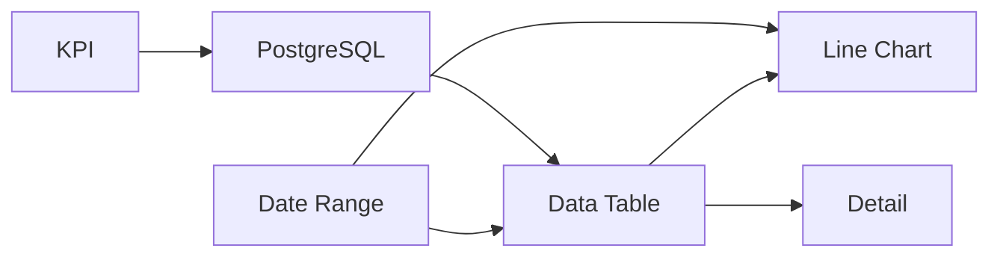

# Builder Creation Assistance

Phase 18 — animated, text-based instructions that show users **how common dashboard components work** and what to add next. Extends [DAS-43](https://planetkevin.atlassian.net/browse/DAS-43) grouping guides from static CSS previews into multi-step walkthroughs with instructional copy.

**Ticket:** [DAS-69](https://planetkevin.atlassian.net/browse/DAS-69) — `feature/DAS-69-builder-creation-assistance`

**Follows:** DAS-68 welcome onboarding · **Precedes:** [AI & BYOK integration](./20-ai-and-byok-integration.md) (Phases 19–20)

---

## Problem

DAS-43 proved the affordances (palette info/link icons, canvas placement prompts) but most users still need to **see** a pattern before they can reproduce it:

- Which ports bind to which?
- What do you add before vs after a table?
- How does a KPI get data from PostgreSQL?

Text-only tooltips are not enough. Users need **animated sequences with numbered steps** — the same mental model as a short tutorial GIF, implemented with lightweight CSS (no video hosting).

---

## Solution

### Three surfaces (unchanged from DAS-43, upgraded content)

| Surface | Upgrade in DAS-69 |
|---------|-------------------|
| **Palette info (i)** | Multi-step animation + numbered instructions |
| **Palette link (chain)** | Same companions; steps reference binding names |
| **Canvas placement prompt** | Shows animation + “Step 2 of 4” copy after add |

### Instruction registry (core)

Extend `packages/core/src/lib/grouping/` with:

```typescript
interface InstructionStep {
  order: number;
  title: string;
  body: string;              // instructional text shown beside animation frame
  highlight?: 'source' | 'target' | 'bind' | 'layout';
}

interface ComponentInstructionGuide extends ComponentGroupingGuide {
  steps: InstructionStep[];
  animationFrames: GroupingAnimationKey[];  // sequence keys cycled in preview
  outcomeSummary: string;                   // one-line “you’ll have …”
}
```

Helpers: `getInstructionGuide(type)`, `listInstructionGuides()`, `getInstructionSteps(type)`.

Animation implementation stays in `apps/client/src/app/builder/grouping/grouping-animation.scss` — add frame variants per step where needed.

---

## Ten initial animated instructions

These are the **most common dashboard building blocks** in DashBuilder today, ordered for learning progression (filters → data → visuals → infra → motion).

### 1. Date range filter

| Field | Value |
|-------|-------|
| **Type** | `visual.input.date-range` |
| **Animation** | `filter-table` (filter block slides down toward consumer) |
| **Outcome** | A time window control that drives scoped queries on tables and charts |

**Steps**

1. **Add the filter** — Place Date Range at the top of your dashboard layout.
2. **Pick a preset** — Choose Last 7 days, Last 30 days, or Custom in the inspector.
3. **Add a consumer** — Add a Data Table or Line Chart below the filter.
4. **Bind the range** — Connect `date-range.value` → `table.filterRange` (or chart equivalent).
5. **Preview** — Switch to Preview mode; changing the range refreshes bound components.

**Typical companions:** Data Table, Line Chart, Time Preset

---

### 2. Data table

| Field | Value |
|-------|-------|
| **Type** | `visual.table` |
| **Animation** | `filter-table` |
| **Outcome** | Sortable tabular view fed by filters and optional database infra |

**Steps**

1. **Add a table** — Place Data Table in the main content area.
2. **Add a time filter** — Date Range or Time Preset above the table.
3. **Bind the filter** — Connect filter output to the table’s filter input port.
4. **Add data source (optional)** — PostgreSQL node for export wiring; preview uses mock API data.
5. **Enable drill-down (optional)** — Add Detail panel; bind `table.selectedRow` → `detail.row`.

**Typical companions:** Date Range, Time Preset, Detail, Skeleton, PostgreSQL

---

### 3. KPI card

| Field | Value |
|-------|-------|
| **Type** | `visual.kpi` |
| **Animation** | `data-stack` (stacked blocks pulse in sequence) |
| **Outcome** | Single metric with delta indicator |

**Steps**

1. **Add a KPI** — Place KPI card in a header row or stat group.
2. **Set labels** — Title and value format in the inspector.
3. **Connect data** — Bind from Table aggregate or PostgreSQL-backed hook in export.
4. **Add context** — Pair with Date Range so the metric respects the selected period.
5. **Preview** — Confirm mock KPI value updates with preview data bundle.

**Typical companions:** PostgreSQL, Data Table, Date Range

---

### 4. Line chart

| Field | Value |
|-------|-------|
| **Type** | `visual.chart.line` |
| **Animation** | `filter-chart` (filter slides toward chart) |
| **Outcome** | Time-series visualization |

**Steps**

1. **Add the chart** — Place Line Chart in the canvas center or right column.
2. **Add Date Range** — Filters define the X-axis time window.
3. **Bind the filter** — Connect range output to chart filter input.
4. **Configure fields** — Set label and value field names to match rowset columns.
5. **Add table (optional)** — Table below chart for drill-down on points.

**Typical companions:** Date Range, Time Preset, Data Table

---

### 5. Bar chart

| Field | Value |
|-------|-------|
| **Type** | `visual.chart.bar` |
| **Animation** | `filter-chart` |
| **Outcome** | Category comparison chart |

**Steps**

1. **Add bar chart** — Place in dashboard body.
2. **Add filter** — Date Range or Time Preset for period scoping.
3. **Bind filter** — Connect to chart filter port.
4. **Add KPIs** — One or two KPI cards above for headline metrics.
5. **Tune categories** — Set category field in inspector to match rowset.

**Typical companions:** Date Range, Time Preset, KPI

---

### 6. Detail drill-down panel

| Field | Value |
|-------|-------|
| **Type** | `visual.detail` |
| **Animation** | `filter-table` (table highlights, detail appears beside/below) |
| **Outcome** | Key-value panel for selected table row |

**Steps**

1. **Add a table first** — Detail needs a row source.
2. **Add Detail panel** — Place adjacent to or below the table.
3. **Bind selection** — Connect `table.selectedRow` → `detail.row`.
4. **Configure fields** — Choose which columns appear as detail keys.
5. **Preview** — Click a table row; detail panel populates.

**Typical companions:** Data Table

---

### 7. Time preset shortcuts

| Field | Value |
|-------|-------|
| **Type** | `domain.time-preset` |
| **Animation** | `filter-table` |
| **Outcome** | One-click Last 7d / QTD / YTD buttons driving same bindings as Date Range |

**Steps**

1. **Add Time Preset** — Compact alternative to full Date Range picker.
2. **Add consumer** — Table or chart that accepts a filter range input.
3. **Bind output** — Connect preset range to consumer filter port.
4. **Set default** — Choose initial preset in inspector.
5. **Preview** — Click presets; bound components update.

**Typical companions:** Data Table, Line Chart, Bar Chart

---

### 8. PostgreSQL data layer

| Field | Value |
|-------|-------|
| **Type** | `infra.postgresql` |
| **Animation** | `server-data` (infra block connects to table/server) |
| **Outcome** | Invisible node that exports connection config and env templates |

**Steps**

1. **Add PostgreSQL** — Infrastructure node (not rendered in UI preview).
2. **Add server partner** — NestJS, Express, Next, or Nuxt infra node for API layer.
3. **Add visual consumer** — Data Table or KPI that reads from the database in export.
4. **Bind data ports** — Wire infra outputs to visual data inputs per export IR rules.
5. **Export** — Download zip includes `.env.example` with `DATABASE_URL` placeholder.

**Typical companions:** Server infra, Data Table, KPI

---

### 9. Loading skeleton

| Field | Value |
|-------|-------|
| **Type** | `visual.skeleton` |
| **Animation** | `data-stack` (skeleton pulses, then content block fades in) |
| **Outcome** | Placeholder shimmer while data loads |

**Steps**

1. **Add skeleton** — Same layout region as the content it replaces.
2. **Add content** — Table, chart, or KPI that will appear when loaded.
3. **Bind loading flag** — Connect checkbox, timer tick, or hook to `skeleton.loading`.
4. **Match variant** — Pick table/chart/kpi/card skeleton shape in inspector.
5. **Preview** — Toggle loading; skeleton hides when data is ready.

**Typical companions:** Data Table, Line Chart, KPI, PostgreSQL

---

### 10. Refresh timer

| Field | Value |
|-------|-------|
| **Type** | `logic.timer` |
| **Animation** | `data-stack` (timer pulses, arrows to data components) |
| **Outcome** | Interval or countdown driving polling refresh |

**Steps**

1. **Add Timer** — Logic node (minimal preview UI).
2. **Set mode** — Interval or countdown in inspector.
3. **Add data visuals** — Table, KPI, or chart to refresh.
4. **Bind tick** — Connect `timer.tick` or `timer.elapsed` to refresh trigger ports.
5. **Preview** — Watch components update on each tick.

**Typical companions:** Data Table, KPI, Line Chart

---

## Composite learning path

Recommended first-session flow (aligns with welcome → builder handoff):



Users can open info panels in this order without AI or API keys.

---

## Acceptance criteria (DAS-69)

- [ ] All 10 instruction guides in core with steps + animation keys
- [ ] Palette info panel renders step list + animated preview per guide
- [ ] Canvas placement prompt shows first missing-companion step text
- [ ] Unit tests: every guide has ≥3 steps; animation keys resolve
- [ ] E2E: info panel for date-range; placement prompt after table add
- [ ] Docs cross-linked from roadmap and AI integration doc

---

## Out of scope (DAS-69)

- BYOK / API keys ([Phase 19](./20-ai-and-byok-integration.md))
- LLM chat or auto-apply ([Phase 20](./20-ai-and-byok-integration.md))
- Auto-create bindings on companion add (future ticket)
- Video assets or Lottie files (CSS animations only)

---

## Related documents

- [AI & BYOK Integration](./20-ai-and-byok-integration.md)
- [Component & Page Design](./15-component-and-page-design.md) — DAS-43
- [Roadmap](./10-roadmap.md)
- [Planned Tickets](./11-planned-tickets.md)
