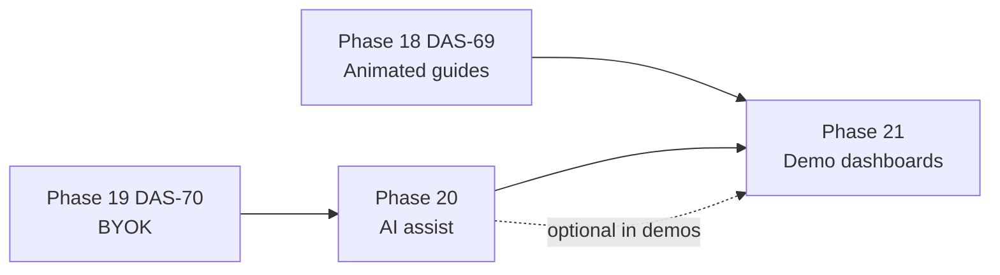

# Animated Demo Dashboards

Three purpose-built example dashboards that demonstrate how to use DashBuilder for different real-world scenarios. Each dashboard will include an **animated walkthrough** — step-by-step guidance showing how to compose layouts from palette components, wire bindings, and apply grouping patterns.

**Phase:** 21  
**Status:** Planned — **design discussion required after Phase 20, before implementation**  
**Prerequisite:** [Phase 20 — AI-assisted creation](./20-ai-and-byok-integration.md) (optional for walkthroughs; animated guides from DAS-69 work without AI)

---

## Why three dashboards

DashBuilder serves multiple audiences. One demo cannot cover every workflow. Three focused examples let us show:

1. **Different component mixes** — charts vs forms vs tables vs 3D
2. **Different domain contexts** — operations, analytics, admin
3. **Different builder skills** — grouping guides, bindings, stack profile, export

These are **showcase artifacts**, not product features. They teach by example.

---

## Draft dashboard concepts

| # | Working title | Purpose | Likely components |
|---|---------------|---------|-------------------|
| 1 | **Operations / KPI** | Team monitoring, alerts, at-a-glance metrics | KPI cards, date range, data table, line chart, skeleton |
| 2 | **Analytics / reporting** | Business intelligence, drill-down, time-series | Date range, filters, bar/line charts, detail panel, pie chart |
| 3 | **Admin / settings** | Configuration, forms, role-aware panels | Form inputs, validation, tabs, role visibility, export-ready layout |

Exact scope, naming, and data stories will be decided in a planning session **after Phase 20 ships**.

---

## Animation approach (to decide)

Options to discuss before build:

| Approach | Pros | Cons |
|----------|------|------|
| **In-builder replay** | Uses existing DAS-69 instruction UI; interactive | Requires builder session; harder to embed |
| **Docs-embedded sequences** | Shareable, no login | Less interactive |
| **Recorded + annotated** | Polished, marketing-friendly | Maintenance cost on UI changes |

Recommendation TBD after Phase 20 — may combine in-builder guides with docs landing pages.

---

## Relationship to other phases

- **DAS-69** provides the animation primitives and grouping knowledge reused in walkthroughs
- **Phase 20 AI** may appear as an optional “build this with AI” segment in one demo — not required
- **Export** should be demonstrated at least once (wizard → zip) across the three examples

---

## Open questions (for planning session)

1. **Hosting** — composite files in repo, seeded projects, or welcome-page templates?
2. **Data** — mock preview data only, or shared fixture datasets?
3. **Stack profile** — one stack for all three, or different UI/server/DB per demo?
4. **Ticket split** — one epic + three stories, or single ticket?
5. **E2E** — smoke tests that open each demo and step through first animation?

---

## Non-goals

- Not a template marketplace or paid add-on
- Not autonomous AI-generated dashboards without user review
- Not replacing [Builder Creation Assistance](./21-builder-creation-assistance.md) per-component guides

---

## Related documents

- [Roadmap — Phase 21](./10-roadmap.md)
- [Builder Creation Assistance](./21-builder-creation-assistance.md) — DAS-69 animated guides
- [AI & BYOK Integration](./20-ai-and-byok-integration.md) — Phases 19–20
- [Component & Page Design](./15-component-and-page-design.md) — page patterns
