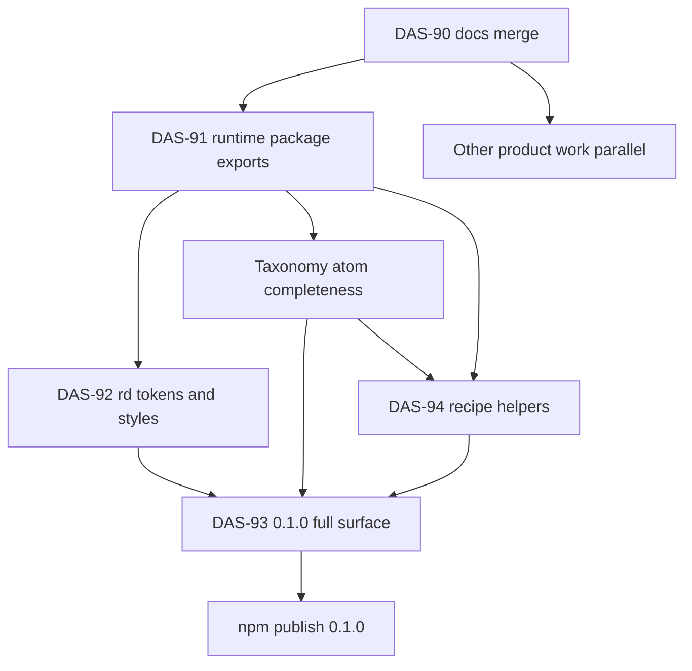

# Post–DAS-90 plan (npm library)

**After:** [DAS-90](https://planetkevin.atlassian.net/browse/DAS-90) docs land on `development`  
**Agents never commit.**

## Locked rules

| Rule | Meaning |
|------|---------|
| **`rosettadash` = git clone** | Product / monorepo only — not a component barrel |
| **Import shape** | `@rosettadash/<runtime>/<group>/…/<component>` (**one or more** groups) |
| **All runtimes** | Same subpaths on `web-components`, `react`, `angular`, `vue`, `svelte`, … |
| **Default runtime** | `web-components` |
| **No `vendor` segment** | Runtime is the package name |
| **Recipes over atoms** | Small helpers; no `composite.*` npm types |
| **Styles** | Minimal; `--rd-*`; opt-in |
| **`0.1.0`** | Full taxonomy on all runtime packages |

## Install vs import

```bash
npm install @rosettadash/web-components
npm install @rosettadash/react
# same pattern for angular, vue, svelte, …
```

```ts
import { Accordion } from '@rosettadash/web-components/layout/accordion';
import { Accordion } from '@rosettadash/react/layout/accordion';
import { VideoSource } from '@rosettadash/svelte/visual/media/video-source';
```

## Delivery order



| Phase | Tickets | Work |
|-------|---------|------|
| A | DAS-90 | Docs merge (done) |
| B | DAS-91 (in progress), DAS-92 | Runtime packages + identical `exports` maps; `--rd-*` CSS (`0.0.x`) |
| C | product | Finish taxonomy atoms in builder/exporters |
| D | DAS-94, DAS-93 | Recipes + full surface on **all** runtimes → **`0.1.0`** |
| E | publish | Scoped runtime packages only; product stays clone |

## Related

- [npm package prep](./33-npm-package-prep.md)  
- [Public component API](./34-public-component-api.md)  
- [Planned tickets](./11-planned-tickets.md)  
